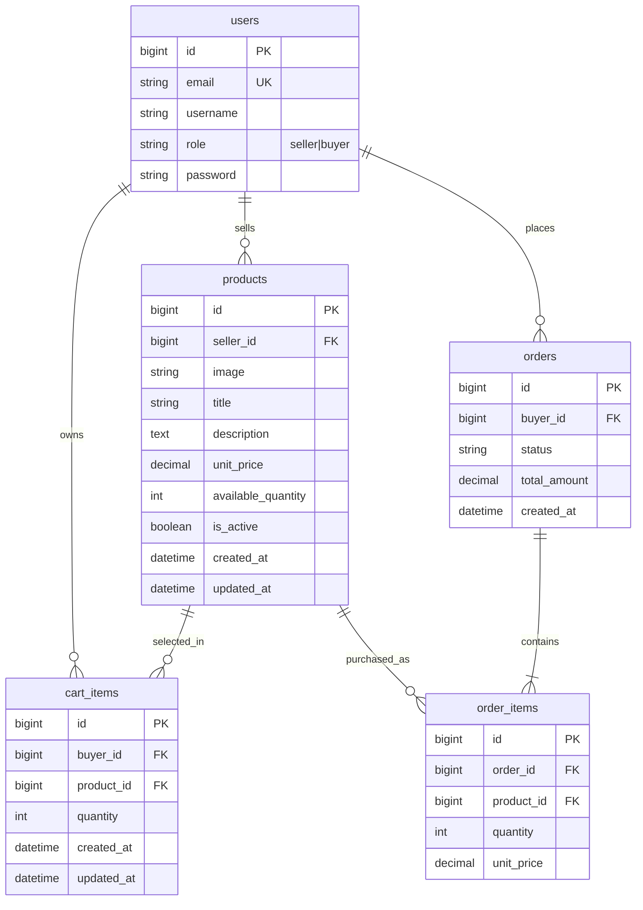

# ER Diagram

## Relationship Notes

- One seller can own many products.
- One buyer can own many cart items.
- `cart_items` has a unique buyer/product pair so repeated adds update the same line.
- One buyer can place many orders.
- Each order contains one or more order items.
- `cart_items` models the current cart relationship between buyers and products.
- `order_items` models the historical many-to-many relationship between orders and products.
- Order items preserve `unit_price` at purchase time so historical totals stay stable even if product prices change later.
- Products use `is_active` for soft deletion. Inactive products remain in the database for order history but are hidden from seller inventory and marketplace listings.
